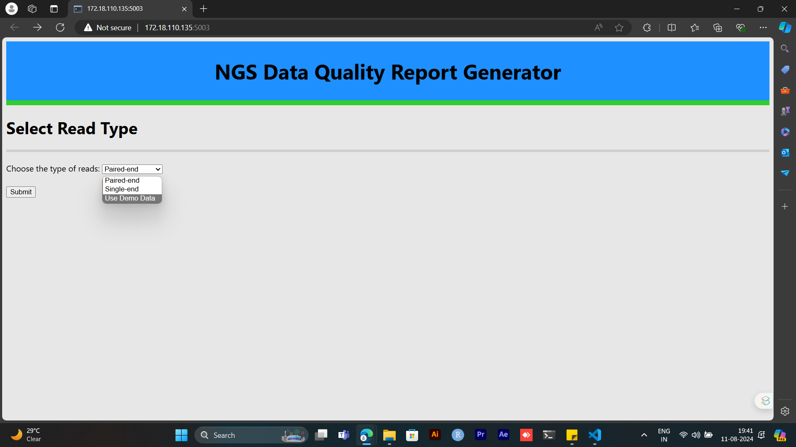
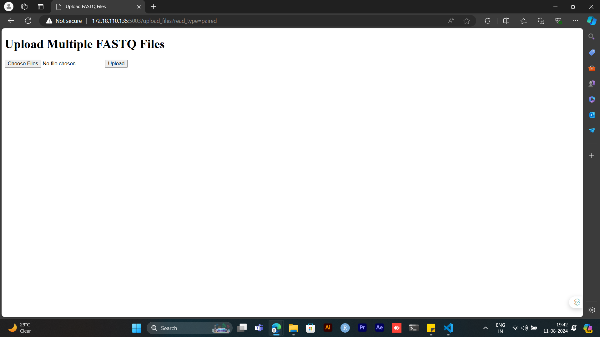
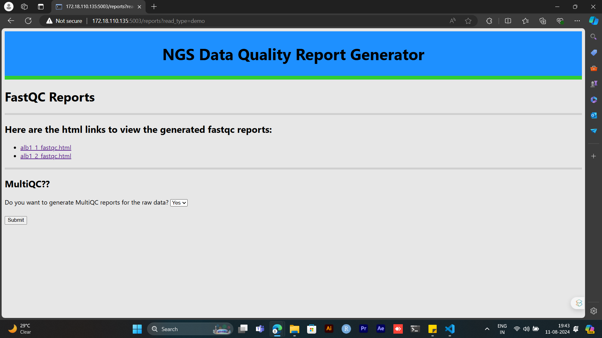
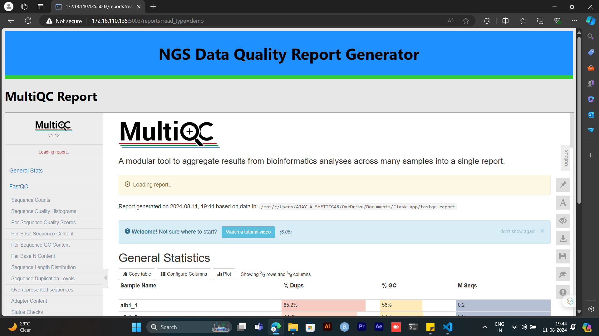
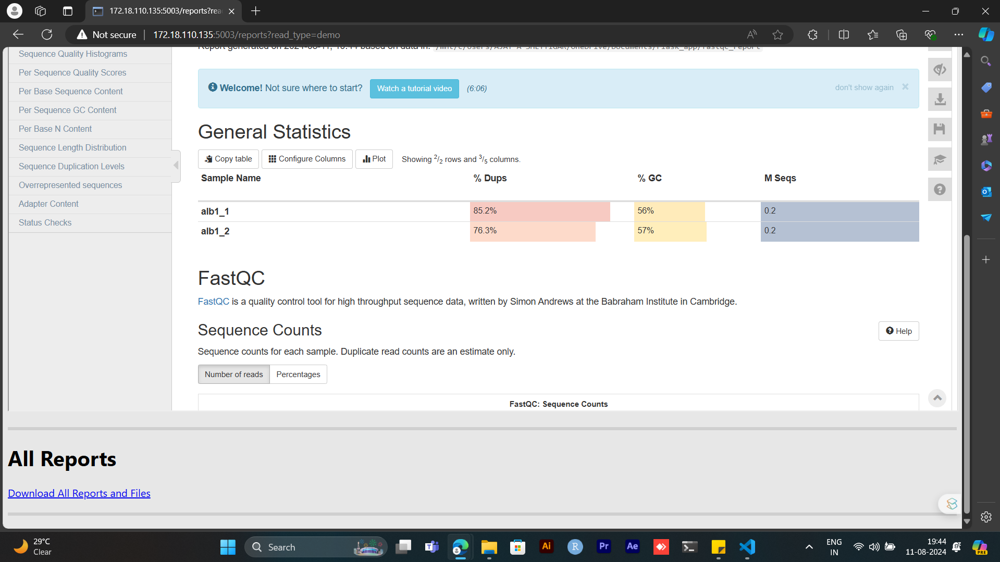
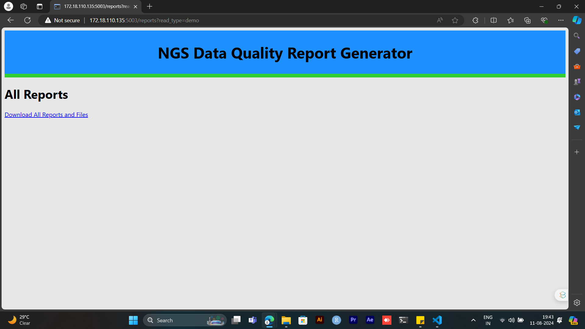

# My First Flask Application

## Overview

Welcome to my first Flask web application! This project is designed to help users generate quality reports for Next-Generation Sequencing (NGS) data. Using this application, you can process raw NGS data files and generate comprehensive quality reports using FastQC and MultiQC tools. The application provides a user-friendly interface for uploading files, performing quality checks, and viewing results.

# Application interface with workflow of NGS Data Quality Report Generator

## 1. Home Page

**Description**: Home page where the user is provided with the provision to select three options: single-end, paired-end, or demo-data. If the user selects demo-data, FastQC reports will start generating.

## 2. Upload Files Page

**Description**: If the user selects an option other than demo-data, a provision for uploading files will be given. After uploading, FastQC reports will be generated.

## 3. FastQC Reports Page

**Description**: The list of FastQC HTML reports will be displayed, with the option to choose the MultiQC step.

## 4. MultiQC Reports Page

**Description**: If the user chooses MultiQC, those reports will be generated along with a provision for the user to download all the reports.

## 5. Download Reports Page



**Description**: If the user doesn't choose the MultiQC step, they will be redirected to a page where they can download all the reports.

## Features

- **File Upload**: Upload raw NGS data files directly through the web interface.
- **Quality Assessment**: Run FastQC on the uploaded files to assess quality.
- **Report Generation**: Generate FastQC reports and optionally run MultiQC to compile and summarize the results.
- **Report Viewing**: View generated reports directly through the application.
- **Download Reports**: Download all generated reports and files in a single zip archive.
- **Demo Data**: Use pre-loaded demo data for quick testing.

## Technologies Used

- **Flask**: A lightweight web framework for Python.
- **FastQC**: A quality control tool for high-throughput sequence data.
- **MultiQC**: A tool for aggregating results from multiple quality control tools.
- **HTML/CSS**: For creating the user interface.
- **Python**: For the backend logic and handling data processing.

## Installation

To run this application locally, follow these steps:

1. **Clone the Repository**:
    ```bash
    git clone https://github.com/ajayashettigar/QC-report-for-NGS-data.git
    cd QC-report-for-NGS-data
    ```

2. **Set Up a Virtual Environment**:
    ```bash
    python -m virtualenv venv
    source env/bin/activate  # On Windows use `venv\Scripts\activate`
    ```

3. **Install Required Packages**:
    ```bash
    pip install flask
    pip install subprocess
    pip install shutil
    pip install zipfile
    ```

4. **Run the Application**:
    ```bash
    python app.py
    ```
    The application will start on `http://localhost:5003`.

## Usage

1. **Access the Application**: Open a web browser and go to `http://http://172.18.110.135:5003`.
2. **Upload Files**: Select "single-end" or "paired-end" to upload your files. If you do not have files, then select "use demo data" to use default demo files.
3. **Generate Reports**: After uploading, the application will process the files and generate FastQC reports. I have also included the provision for performing MultiQC if the user choose to.
4. **View and Download Reports**: You can view and download all reports and files in a zip archive.

## Collaorations!

Contributions are welcome! If you have suggestions or improvements, feel free to open an issue or submit a pull request.

## Acknowledgements
This project uses the following tools and libraries:

### FastQC: A quality control tool for high-throughput sequence data. [cite](https://www.bioinformatics.babraham.ac.uk/projects/fastqc/)
### MultiQC: Aggregates results from multiple quality control tools into a single report. [cite](https://multiqc.info/)
### Flask: A lightweight WSGI web application framework. [cite](https://flask.palletsprojects.com/en/3.0.x/)

## Contact

For any questions or feedback, please contact [Ajay A Shettigar](mailto:ajshettigar1253@gmail.com).
